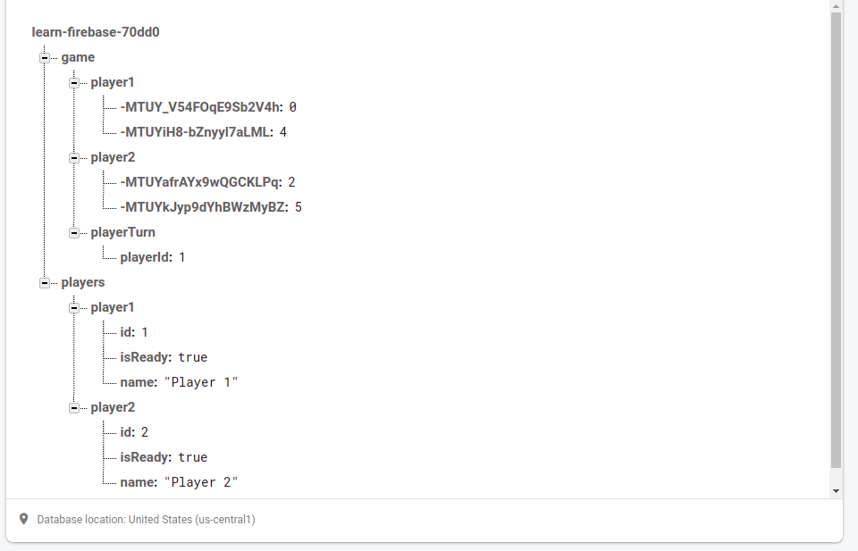
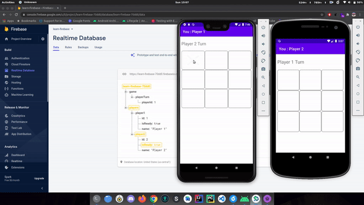

# Simple TicTacToe Multiplayer with Realtime Database
Tic-tac-toe, noughts and crosses, or Xs and Os/“X’y O’sies”, is a paper-and-pencil game for two players, X and O, who take turns marking the spaces in a 3×3 grid. The player who succeeds in placing three of their marks in a diagonal, horizontal, or vertical row is the winner.

# How to play ?
In order to win the game, a player must place three of their marks in a horizontal, vertical, or diagonal row.

# Realtime database structure

  

# Game Result

  

